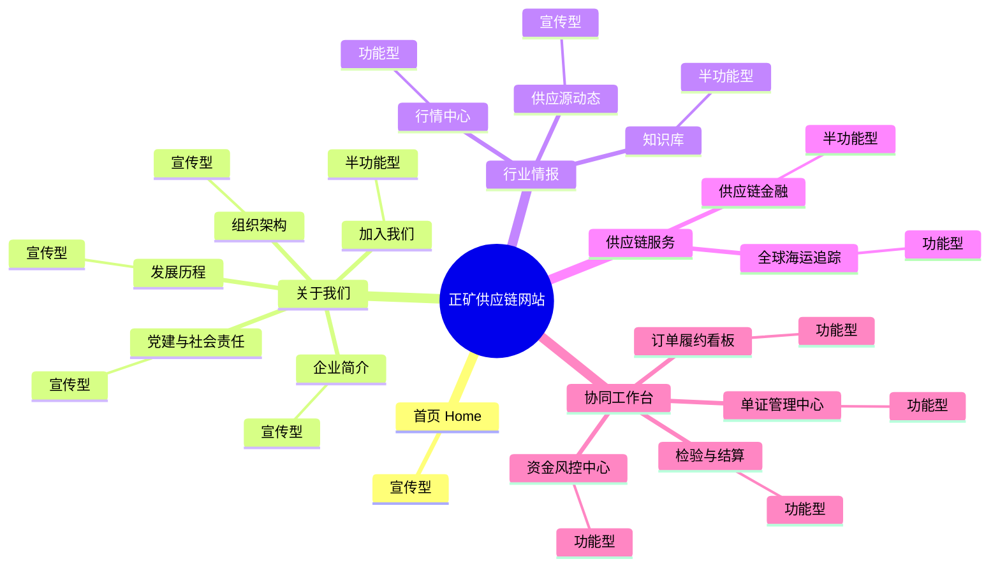
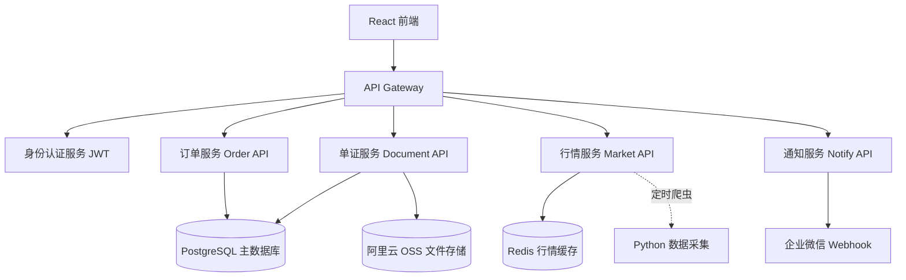

# 正矿供应链网站 · 全站架构脑图 & 执行分析

## 站点脑图



---

## 一、宣传型页面（Promotional）

> 维护要求：**内容更新**，无需后端，由运营团队定期更新文字/图片素材。

| 页面 | 当前状态 | 需要组织的材料 |
|---|---|---|
| **首页** | ✅ 已上线 | ① 首屏Banner主视觉图 ② 最新一句核心口号 ③ 三大业务入口图标/说明 |
| **企业简介** | ✅ 基础版 | ① 公司正式简介（300-500字） ② 合作伙伴Logo ③ 核心团队照片和头衔 |
| **组织架构** | ✅ 动态图 | ① 核实最新岗位架构 ② 各部门职能描述（可选） |
| **发展历程** | ⚠️ 占位 | ① 2010→2024 大事记（年份+1句话+可选图片） |
| **党建与社会责任** | ⚠️ 占位 | ① 党支部活动照片 ② ESG数据（碳排、公益捐助金额）③ 党建文章 |
| **加入我们** | ⚠️ 占位 | ① 3-5个职位JD（岗位名/职责/要求）② 公司文化照片 ③ 简历投递邮箱 |
| **供应源动态** | ⚠️ 占位 | ① 产区周报文章（每产区1篇，约500字+配图）② 更新频率建议：每月1次 |
| **知识库** | ✅ 文章卡片 | ① 11篇文章全文（目前只有摘要）② PDF下载件（标注hasDownload=true的） |

---

## 二、功能型页面（Functional）

### 📊 2A · 行情中心

**类型：** 半功能型（目前Mock数据，需升级为真实接口）

**业务逻辑：**
1. 每日定时抓取或接收价格数据（锆英砂/钛精矿/金红石）
2. 前端按产品Tab + 时段（1M/3M/6M/1Y）展示趋势图
3. 供应源开工率从人工维护或外部数据源更新

**维护技能：** 前端 React + 数据对接（API接入或人工更新JSON）

| 升级方案 | 说明 | 成本 |
|---|---|---|
| **方案A（免费）** | 人工每周更新`mockData.js`中的价格 | 人工维护，≈1小时/周 |
| **方案B（半自动）** | 编写Python爬虫（铁合金在线/瑞道），结果写入JSON文件 | 需Python服务器 |
| **方案C（API接入）** | 购买第三方矿产数据API（如上海有色SMM等） | ¥5,000-50,000/年 |

---

### 🗺️ 2B · 全球海运追踪

**类型：** 功能型（目前Mock数据，正式使用需对接真实AIS）

**业务逻辑：**
1. 按订单号查询绑定的船舶MMSI码
2. 实时获取船位（lat/lon）、航速、ETA
3. 在地图上绘制已行驶轨迹 + 当前位置
4. 港口拥堵系数从外部数据源获取

**维护技能：** 前端 React/Leaflet + WebSocket/REST数据对接

| 升级方案 | 实时性 | 成本 |
|---|---|---|
| **aisstream.io** | 近实时 WebSocket | 免费（个人），$50+/月（商业） |
| **VesselFinder API** | 每5分钟 REST | $150/月起 |
| **MarineTraffic API** | 商业级 | $500+/月 |

> **执行计划（推荐 aisstream.io）：**
> 1. 注册 aisstream.io，获取 API Key
> 2. 修改 `Logistics.jsx`，用 WebSocket 订阅指定 MMSI 列表
> 3. 将 `ROUTES` mock 数据替换为实时坐标更新
> 4. 需要：订单表中维护每票货的 MMSI 码对应关系

---

### 💰 2C · 供应链金融

**类型：** 半功能型（融资成本计算器为前端计算，联系咨询为静态）

**业务逻辑：**
1. 展示3类融资产品说明
2. 融资计算器：纯前端 JS 计算（金额×利率×天数）
3. "获取专属方案"按钮 → 触发联系表单或跳转企业微信

**维护要求：**
- 利率参数由运营人员更新（修改代码中的 `rate` 默认值）
- 如需在线申请表单：需接入邮件发送服务（SendGrid/企业微信Webhook）

---

### 📄 2D · 单证管理中心

**类型：** 功能型（目前Mock，正式使用需文件存储后端）

**业务逻辑：**
1. 供应商通过前端上传单证文件（PDF/图片）
2. 系统按订单号关联单证，标记状态（待提交/审核中/已通过）
3. 内部人员在线审核，更新状态
4. 到期提醒、银行提交确认

**所需后端系统：**

```
┌─────────────────────────────────────────────┐
│ 数据存储层                                   │
│   • 文件存储：阿里云 OSS / 腾讯云 COS        │
│   • 关系数据库：PostgreSQL 或 MySQL           │
│     - documents 表（id, order_id, type,      │
│       status, file_url, uploaded_at）        │
│     - orders 表（id, product, vessel, ...）  │
└─────────────────────────────────────────────┘
┌─────────────────────────────────────────────┐
│ 后端 API 层（Node.js / Python FastAPI）      │
│   POST /docs/upload    上传文件              │
│   GET  /docs/:orderId  查询订单单证列表      │
│   PATCH /docs/:id/status  更新审核状态       │
└─────────────────────────────────────────────┘
┌─────────────────────────────────────────────┐
│ 身份认证层                                   │
│   • JWT Token 登录态                        │
│   • 角色权限：供应商 / 运营员 / 管理员        │
└─────────────────────────────────────────────┘
```

**执行计划（分2期）：**
- **一期（内部可用）：** 用 Airtable / 飞书多维表格 作为临时数据库，前端表单 + Webhook 完成上传通知
- **二期（正式）：** 搭建独立 Node.js API + PostgreSQL + OSS，约需 2-4 周开发

---

### 🛡️ 2E · 资金风控中心

**类型：** 功能型（目前Mock，正式使用需 ERP/财务系统对接）

**业务逻辑：**
1. 读取各授信额度的已用/可用余额
2. 计算月度利用率趋势
3. 解析所有订单的付款节点（TT尾款日期、LC到期日）
4. 自动预警：付款日前 7 天发送企业微信通知

**所需后端：**
- 同单证管理中心数据库的 `orders` 表
- 新增：`credit_lines` 表（银行/额度/已用）、`payment_nodes` 表
- 企业微信 Webhook 接口（预警推送）

**执行计划：**
| 阶段 | 内容 | 周期 |
|---|---|---|
| 1. 数据结构设计 | 设计 orders/credit/payment 三张表 | 3天 |
| 2. 手动维护模式 | 运营人员填写飞书表格，前端读取 | 1周 |
| 3. API对接 | 后端REST API替换Mock数据 | 2-3周 |
| 4. 智能预警 | 企业微信Bot定时推送付款节点 | 1周 |

---

### 📦 2F · 订单履约看板 + 检验与结算

**类型：** 功能型（核心业务系统）

**业务逻辑（完整链路）：**
```
采购合同签订
  → 开证/TT付款
  → 供应商装货 + 上传提单
  → 船公司在航（AIS追踪）
  → 到港卸货
  → CIQ/SGS化验取样
  → 品位确认 → 结算引擎计算（已实现）
  → 生成对账单 → 付款确认
  → 完结
```

**所需后端：** 与单证管理中心共享数据库

---

## 三、整体后端架构建议（若全功能化）



---

## 四、优先级建议

| 优先级 | 任务 | 预估周期 | 备注 |
|---|---|---|---|
| 🔴 立即 | 完善宣传页内容素材 | 1-2周 | 无需开发，运营组织材料 |
| 🔴 立即 | 加入我们 + 简历表单 | 3天 | 接入邮件Webhook |
| 🟡 中期 | 企业微信付款预警 | 1周 | 接入微信机器人 |
| 🟡 中期 | 行情数据Python爬虫 | 2周 | 替代人工更新 |
| 🟢 长期 | 单证+订单后端数据库 | 1-2月 | 核心系统建设 |
| 🟢 长期 | AIS实时船位对接 | 1周（接入后） | 需购买API授权 |
